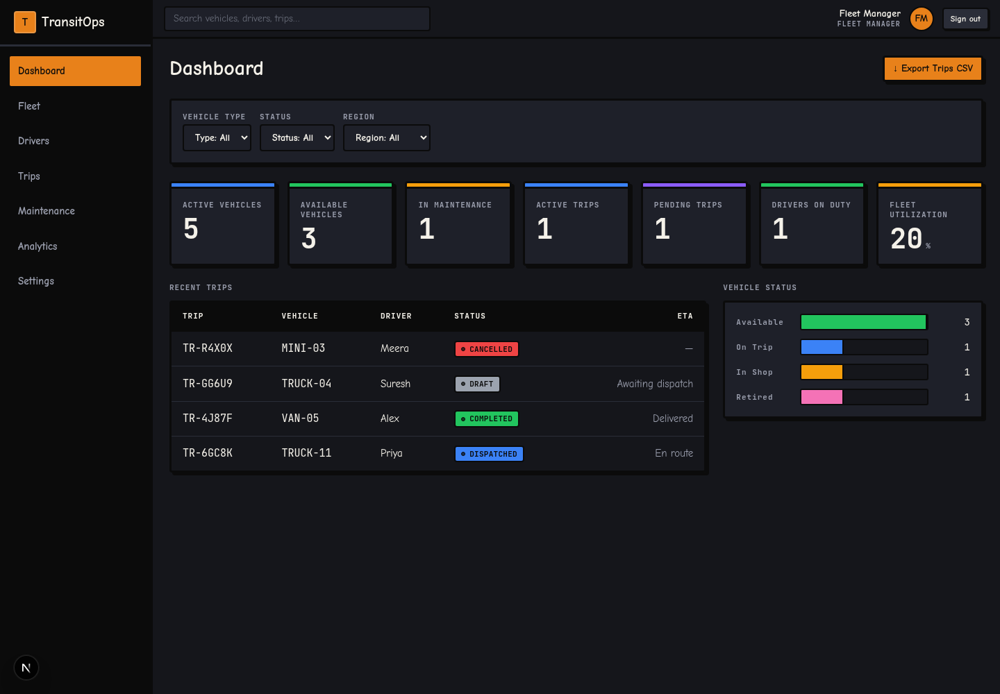
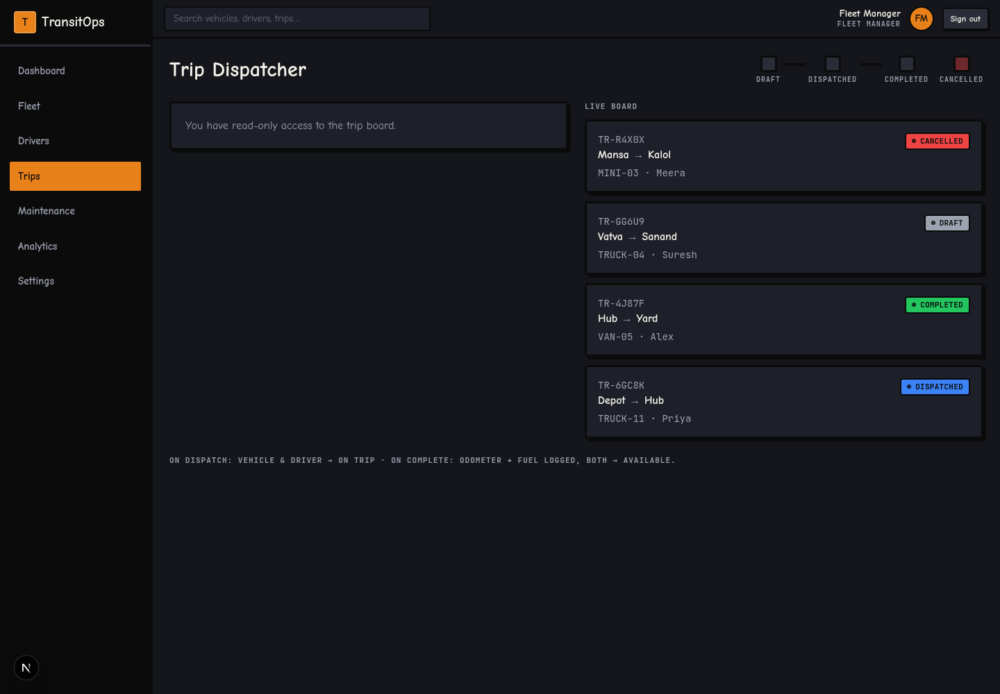
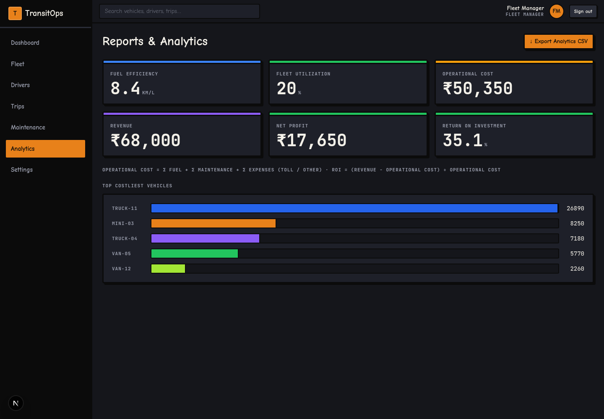
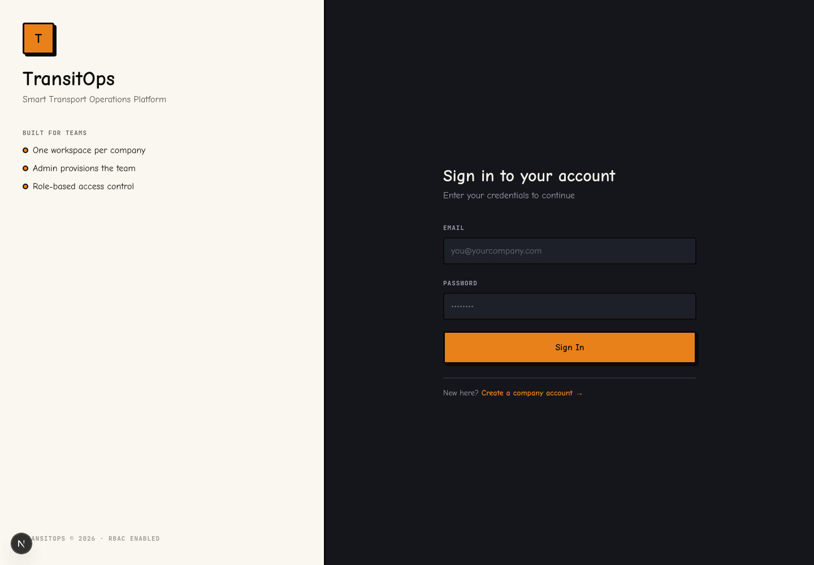
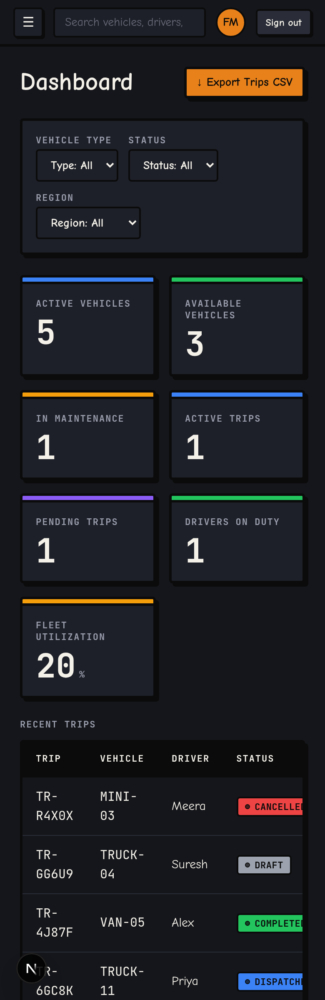

<p align="center">
  
</p>

<h1 align="center">TransitOps</h1>

<p align="center">
  <strong>Smart Transport Operations Platform</strong><br />
  Fleet, dispatch, maintenance, fuel, expenses, analytics, and RBAC in one neo-brutalist operations cockpit.
</p>

<p align="center">
  
  
  
  
  
  
</p>



## Preview

TransitOps is built as a dark, high-contrast, neo-brutalist cockpit with playful Comic Neue typography and operationally serious workflows underneath.

| Trip Dispatcher | Reports & Analytics |
|---|---|
|  |  |

| Login Experience | Mobile Dashboard |
|---|---|
|  |  |

## Feature Highlights

TransitOps is not just a CRUD dashboard. It is a rule-aware transport operations system where each workflow updates the rest of the business state around it.

| Area | What You Get |
|---|---|
| Operations Cockpit | Fleet KPIs, recent trips, vehicle status bars, utilization, dashboard filters, and CSV export. |
| Dispatch Control | Trip creation, dispatch lifecycle, live board, cargo capacity validation, and atomic vehicle/driver status updates. |
| Fleet Registry | Vehicle onboarding, registration tracking, type/capacity/odometer data, status management, retirement, import, and export. |
| Driver Safety | Driver profiles, license category and expiry tracking, safety scores, duty status, suspension visibility, import, and export. |
| Maintenance Desk | Active and closed maintenance logs, repair descriptions, costs, vehicle linkage, and close-out workflows. |
| Finance Console | Fuel logs, tolls, maintenance-related expenses, other expenses, sample CSVs, import, and export. |
| Reports & Analytics | Fuel efficiency, utilization, operational cost, revenue, net profit, ROI, and top costliest vehicles. |
| Team Admin | Company-scoped users, role assignment, active/inactive controls, and admin-only team management. |

## Product Modules

| Module | Built-In Capabilities |
|---|---|
| Dashboard | Active vehicles, available vehicles, vehicles in maintenance, active trips, pending trips, drivers on duty, fleet utilization, vehicle status chart, recent trip table, filters by vehicle type/status/region, and trip CSV export. |
| Fleet | Add and manage vehicles, track registration number, vehicle name, type, capacity, odometer, acquisition cost, region, lifecycle status, CSV import, sample CSV download, and CSV export. |
| Drivers | Add and manage drivers, track license number, license category, license expiry, contact number, safety score, availability status, suspension state, CSV import, sample CSV download, and CSV export. |
| Trips | Create draft trips, assign eligible vehicles and drivers, validate cargo weight against vehicle capacity, dispatch trips, complete trips with distance/fuel/revenue details, cancel trips, and monitor the live trip board. |
| Maintenance | Create maintenance logs, attach repairs to vehicles, record service cost, track active versus closed maintenance, and close maintenance jobs when work is complete. |
| Fuel & Expenses | Record fuel by vehicle, log liters and cost, track tolls and other expenses, support maintenance expense visibility, import fuel/expense CSVs, download sample templates, and export finance data. |
| Analytics | Calculate fleet-wide fuel efficiency, utilization, operational cost, revenue, net profit, ROI, and ranked vehicle cost bars from the seeded operational data. |
| Settings | View company settings, currency and distance units, switch theme, and show the admin RBAC matrix for operational visibility. |

## Workflow Rules

| Rule | Why It Matters |
|---|---|
| Vehicle and driver eligibility | Dispatch only uses available assets and available drivers, preventing accidental double assignment. |
| Cargo capacity guard | Trip cargo cannot exceed the selected vehicle's maximum load capacity. |
| Dispatch transaction | Dispatching a trip updates the trip, vehicle, and driver together so the board never drifts out of sync. |
| Completion transaction | Completing a trip records actual distance and fuel while returning the vehicle and driver to availability. |
| Maintenance lifecycle | Maintenance records move from active to closed, preserving cost and service history. |
| Tenant scoping | Every company sees only its own users, vehicles, drivers, trips, logs, and expenses. |

## Platform Features

| Capability | Details |
|---|---|
| Authentication | Email/password login, bcrypt password hashing, cookie-backed sessions, protected routes, and company signup. |
| RBAC | Admin, Fleet Manager, Driver, Safety Officer, and Financial Analyst roles with route guards and server-action checks. |
| Global Search | Debounced top-bar search across vehicles, drivers, and trips with keyboard navigation. |
| CSV Import | Upload vehicles, drivers, fuel logs, and expenses with row-level skipped-record feedback. |
| CSV Export | Export trips, vehicles, drivers, fuel logs, expenses, and analytics from role-allowed screens. |
| Sample Data | Seed script loads demo companies, users, vehicles, drivers, trips, maintenance, fuel, and expense records. |
| Responsive Shell | Desktop sidebar, mobile navigation, dark cockpit styling, hard shadows, status pills, and theme switching. |
| Docker Ready | Full-stack Docker Compose setup with Next.js, PostgreSQL, migrations, optional seeding, and standalone production output. |

## Roles

| Role | Access Profile |
|---|---|
| Admin | Company settings, team management, user activation, role assignment, and RBAC visibility. |
| Fleet Manager | Fleet CRUD, driver CRUD, maintenance CRUD, dashboard visibility, trip visibility, and analytics visibility. |
| Driver | Dashboard visibility, trip creation, dispatch, completion, cancellation, and live trip board management. |
| Safety Officer | Driver compliance CRUD, dashboard visibility, and read-only trip visibility. |
| Financial Analyst | Fuel and expense CRUD, analytics access, operational cost reporting, dashboard visibility, and fleet visibility. |

## Data Model

| Entity | Purpose |
|---|---|
| Company | Multi-tenant workspace boundary for every operational record. |
| User | Authenticated teammate with role, active state, email, password hash, and company membership. |
| Vehicle | Fleet asset with registration, capacity, odometer, acquisition cost, region, status, and history links. |
| Driver | Assignable driver profile with license data, contact details, safety score, duty status, and optional user link. |
| Trip | Dispatch workflow record connecting vehicle, driver, route, cargo, lifecycle timestamps, fuel, distance, and revenue. |
| Maintenance Log | Vehicle service record with description, cost, active/closed status, and close timestamp. |
| Fuel Log | Vehicle fuel record with liters, cost, date, and optional trip linkage. |
| Expense | Vehicle expense record for toll, maintenance display, or other operational spend. |

## Tech Stack

| Layer | Technology |
|---|---|
| App | Next.js 16, React 19, TypeScript |
| Styling | Tailwind CSS v4, custom neo-brutalist UI components |
| Data | PostgreSQL 16, Prisma 7 |
| Auth | Cookie sessions, bcrypt password hashing, RBAC guards |
| Tooling | ESLint, TypeScript, Docker Compose, seed data |

> Next.js is v16 in this project. APIs and conventions differ from older Next.js versions. Check `node_modules/next/dist/docs/` before changing framework-level code.

## Run With Docker

The full stack can run with Docker Compose: Next.js app, PostgreSQL, migrations, and optional seed data.

```bash
cp .env.example .env
docker compose up --build
```

Open `http://localhost:3000` after the containers are healthy.

To load the demo workspace on startup, set `SEED_DB=true` in `.env`, then run:

```bash
docker compose up --build
```

Useful Docker commands:

| Command | Does |
|---|---|
| `docker compose up --build` | Build and run the app plus Postgres |
| `docker compose down` | Stop containers but keep database volume |
| `docker compose down -v` | Stop containers and delete Postgres data |
| `docker compose logs -f app` | Stream app logs |

## Local Setup

Requires Docker for Postgres, plus Node and npm for the app.

```bash
docker compose up -d
cp .env.example .env
npm install
npm run db:migrate
npm run db:seed
npm run dev
```

Open `http://localhost:3000` after the dev server starts.

Seeded demo accounts use the shared password `password123`:

| Account | Role |
|---|---|
| `admin@transitops.dev` | Admin |
| `manager@transitops.dev` | Fleet Manager |
| `driver@transitops.dev` | Driver |
| `safety@transitops.dev` | Safety Officer |
| `finance@transitops.dev` | Financial Analyst |

## Scripts

| Command | Does |
|---|---|
| `npm run dev` | Start the development server |
| `npm run build` | Create a production build |
| `npm run start` | Serve the production build |
| `npm run lint` | Run ESLint |
| `npm run typecheck` | Run `tsc --noEmit` |
| `npm run db:migrate` | Run `prisma migrate dev` |
| `npm run db:seed` | Load demo data |
| `npm run db:studio` | Open Prisma Studio |
| `npm run db:reset` | Reset, migrate, and seed the database |

## Project Layout

| Path | Purpose |
|---|---|
| `src/app` | App routes, layouts, authenticated pages, and API routes |
| `src/components` | Shell, forms, tables, filters, and reusable UI primitives |
| `src/core` | Database, security, RBAC, errors, and shared utilities |
| `src/modules` | Feature services, repositories, and Zod schemas |
| `src/lib` | Server actions, queries, sessions, constants, and helpers |
| `prisma` | Schema, migrations, generated client target, and seed script |
| `public/readme` | README icon and captured preview images |

## Sources Of Truth

| Concern | Authority |
|---|---|
| Database schema | `prisma/schema.prisma` |
| UX and layout | `wireframe/` |
| Visual language | Neo-brutalism and Comic Neue, documented in `plan.md` |
| Build spec | `plan.md` |

## Notes

The current app is seeded for multiple companies, so screenshots and demo data may differ slightly after reseeding. The README preview images were captured from the running local app using the seeded TransitOps workspace.

## License

Released under the [MIT License](LICENSE).
