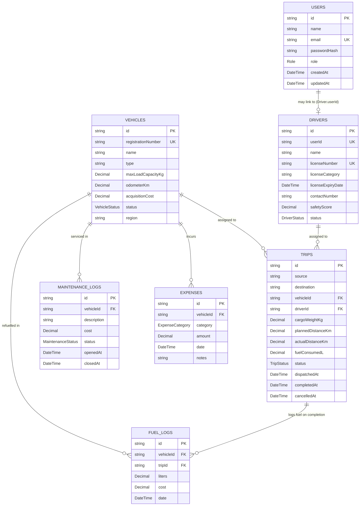
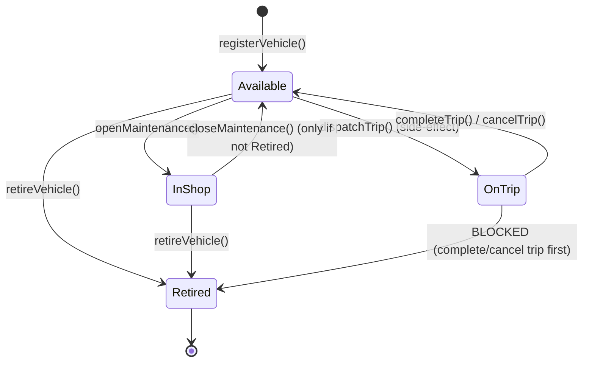
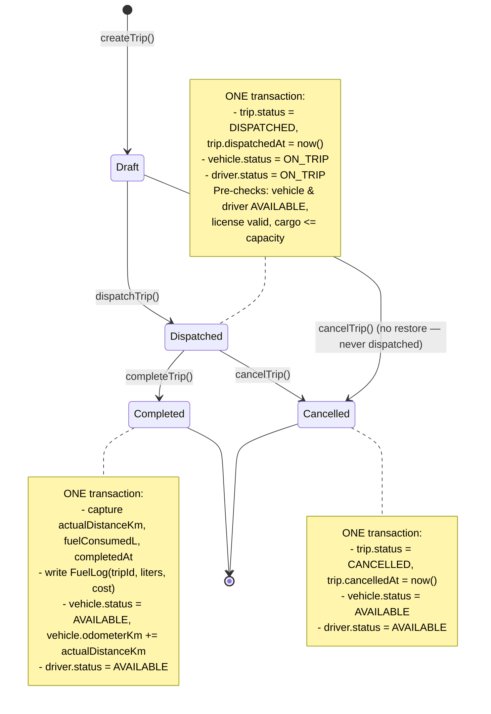
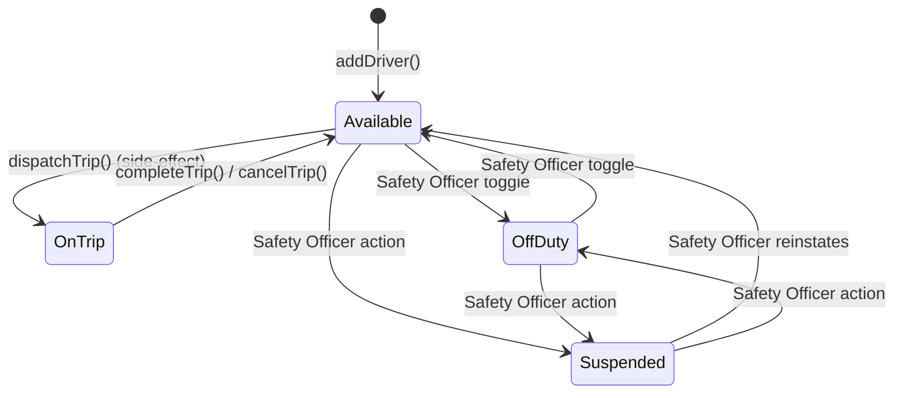

<div align="center">

# 🚚 TransitOps — Build Plan

### Smart Transport Operations Platform · Neo-Brutalist × Comic Sans Edition

**A centralized platform to manage the full lifecycle of transport operations — vehicles, drivers, dispatch, maintenance, fuel & expenses — with enforced business rules and live operational insight.**

`Next.js 16` · `React 19` · `TypeScript` · `Tailwind v4` · `Prisma 7 + PostgreSQL (local)` · `Auth.js` · `Recharts`

</div>

---

## 📑 Table of Contents

1. [Product Overview](#-product-overview)
2. [Technology Stack](#technology-stack)
3. [Database Design & Strategy](#database-design--strategy)
4. [Design System — Neo-Brutalist × Comic Sans](#design-system--neo-brutalist--comic-sans)
5. [Screen-by-Screen Specification](#screen-by-screen-specification)
6. [Business Rules, State Machines & RBAC](#business-rules-state-machines--rbac)
7. [Analytics, Reporting & Bonus Features](#analytics-reporting--bonus-features)
8. [Build Plan — 3-Person Phase Split](#build-plan--3-person-phase-split)

> **Sources of truth (read these before writing code):**
> - **Database** → `prisma/schema.prisma`. This document describes only what the schema actually contains. If a claim here and the schema disagree, **the schema wins** — fix this doc, not the schema.
> - **UX / layout** → the wireframes in `wireframe/`.
> - **Visual language** → Neo-Brutalism + Comic Sans (see §4). Non-negotiable.
> - **Next.js is v16** — APIs differ from older docs. Read the guides in `node_modules/next/dist/docs/` before writing framework code.
>
> **Canonical decisions used throughout.** The four login roles are `FLEET_MANAGER`, `DRIVER`, `SAFETY_OFFICER`, `FINANCIAL_ANALYST` (a `Role` enum on `users`, not a separate table). The **Driver** login role is the *trip-operations* role — it creates and dispatches trips; the **`Driver` entity** is the assignable person behind the wheel (a Driver row may optionally link to a login user via `Driver.userId`). Auth route is **`/login`**; fuel & expenses route is **`/expenses`**. Fleet-wide **Operational Cost** = `Σ fuel_logs.cost + Σ maintenance_logs.cost + Σ expenses(TOLL,OTHER)` — `MAINTENANCE`-category expenses are display-only and never summed, so maintenance is never double-counted. **Fuel efficiency** = `Σ trips.actualDistanceKm / Σ trips.fuelConsumedL` over completed trips. There is **no revenue/ROI, no per-trip odometer snapshot, no soft-delete, no account-lockout** — those are not in the schema. The demo seed is **4 role users, 6 vehicles, 5 drivers, 4 trips** plus supporting logs/expenses. CSV export is served from **`/api/export/[dataset]`**.

---

## 🧭 Product Overview

**The problem.** Many logistics companies still run on spreadsheets and paper logbooks — causing scheduling conflicts, underutilized vehicles, missed maintenance, expired licenses, sloppy expense tracking, and zero operational visibility.

**The build.** TransitOps digitizes the entire transport operation behind a role-gated, rule-enforcing web app that looks like nothing else in the room: a dark ops cockpit rendered in **neo-brutalist blocks** with **Comic-style typography** — playful on the surface, rigorous underneath.

**Four roles, one login (RBAC):**

| Role | Owns | Landing focus |
|---|---|---|
| **Fleet Manager** | Fleet assets, maintenance, vehicle lifecycle, analytics | Fleet + Maintenance |
| **Driver** | Trip creation, vehicle/driver assignment, live delivery monitoring | Dashboard + Trips |
| **Safety Officer** | Driver compliance, license validity, safety scores | Drivers + Compliance |
| **Financial Analyst** | Expenses, fuel, maintenance cost, operational cost | Fuel & Expenses + Analytics |

**Seven core entities:** Users · Vehicles · Drivers · Trips · Maintenance Logs · Fuel Logs · Expenses. (Roles are a `Role` enum on `users`.)

**The crown jewel** is the **Trip Dispatcher**: available-only pickers, a live cargo-vs-capacity guard, and a single atomic transaction that flips a trip → *Dispatched* while marking its vehicle **and** driver *On Trip*. Nail this and every other screen orbits it.

---

## Technology Stack

### At a Glance

| Layer | Choice | Status | Why |
|---|---|---|---|
| Framework | **Next.js 16** (App Router, React 19, Server Actions) | ✅ installed | RSC + Server Actions collapse the API tier — fewer moving parts |
| Language | **TypeScript** (`strict: true`) | ✅ | Catch RBAC/business-rule mistakes at compile time |
| Styling | **Tailwind CSS v4** + custom neo-brutalist tokens | ✅ installed | v4's CSS-first `@theme` makes thick borders/hard shadows trivial |
| Fonts | **Comic Neue** via `next/font` + `'Comic Sans MS'` fallback, **JetBrains Mono** for numbers | ⬜ to add | The aesthetic mandate, self-hosted with zero layout shift |
| ORM | **Prisma 7** + **`@prisma/adapter-pg`** | ✅ installed | `schema.prisma` is the single source of truth; adapter connects to local Postgres over `pg` |
| Database | **PostgreSQL 16** (local, Docker) | ⬜ compose file added | Runs on the dev machine; no cloud, fully offline |
| Auth | **Auth.js (NextAuth v5)** — Credentials + JWT | ⬜ to add | Role-in-token + middleware guards map 1:1 to the 4-role RBAC matrix |
| Validation | **Zod** (shared client + server) | ⬜ to add | One schema drives forms, Server Actions, and DB writes |
| Server state | **RSC + Server Actions** | — | Mutations that enforce rules live server-side by default |
| Charts | **Recharts** | ⬜ to add | Composable SVG bars/KPIs, easy to restyle brutalist |
| Tables | **TanStack Table** (optional) | ⬜ to add | Headless sort/filter/search for the data grids |
| CSV | **PapaParse** | ⬜ to add | Mandatory CSV export in a few lines |
| Forms | **React Hook Form** + `zodResolver` | ⬜ to add | Fast uncontrolled inputs wired to the shared Zod schemas |
| Animation | **Framer Motion** (`motion`) | ⬜ optional | Chunky hover/press micro-interactions |
| Tooling | **Prisma Migrate + Studio**, ESLint (next config), seed script | ✅ partial | Versioned migrations, demo-ready data |

> **Reality check.** Only `next`, `react`, `prisma`/`@prisma/client`/`@prisma/adapter-pg`, `tailwindcss`, `eslint` are installed today. Everything marked ⬜ is added by the phase that needs it (see §8). The stack above is the *target*, not the current `package.json`.

### Framework

**Next.js 16** (App Router, React 19, Server Actions). Server Components fetch fleet/trip data directly; Server Actions let every mutation enforce the mandatory business rules (uniqueness, capacity, license/status gates, status transitions) server-side — no separate REST layer. **Next 16 has breaking changes vs older majors** — consult `node_modules/next/dist/docs/` before writing framework-level code (route handlers, middleware, server actions, caching).

### Language

**TypeScript with `strict: true`.** The RBAC matrix, entity statuses, and pill-color unions are all discriminated types — strict mode turns an illegal `status` into a red squiggle instead of a runtime bug on stage.

### Styling

**Tailwind CSS v4** with brutalist design tokens (thick `border-[3px] border-ink`, hard offset shadows `shadow-[6px_6px_0_0_#000]`, blocky high-contrast fills, orange accent). Load **Comic Neue** through `next/font` with a fallback stack of `'Comic Sans MS', 'Comic Sans', cursive` so the comic look holds even before the webfont lands, with no CLS. **JetBrains Mono** for all numeric/tabular data.

### Data Layer / ORM

**Prisma 7** with the **`@prisma/adapter-pg`** driver adapter (already wired in `prisma/seed.ts` and expected in the client singleton). `schema.prisma` is the single, readable source of truth, and **Prisma Migrate** gives versioned SQL migrations. The client is generated to `src/generated/prisma` (gitignored). One caveat for this app: Prisma has no first-class `SELECT … FOR UPDATE`, so the dispatch/complete row locks are taken with a one-line `$queryRaw` inside an interactive transaction (see §6).

### Database

**Local PostgreSQL 16** via a one-service `docker-compose.yml` (`postgres:16` + a named volume). No cloud account, no cold starts — the demo runs entirely offline. `DATABASE_URL` in `.env` points at it (see `.env.example`).

### Auth

**Auth.js (NextAuth v5)** with the **Credentials provider**: passwords hashed with bcrypt, **JWT sessions**, and the user's `role` embedded in the token via the `jwt` callback. A single `middleware.ts` reads the role and gates routes to match the RBAC matrix. (No account-lockout — the schema has no `failed_login_attempts`/`locked_until` columns.)

### Validation

**Zod**, schemas shared across client and server. Each entity gets one schema powering the React Hook Form resolver *and* re-running inside the Server Action, so validation (cargo weight ≤ capacity, unique registration, license not expired, `licenseCategory ∈ {LMV, HMV}`) can never be bypassed by the client.

### Charts

**Recharts** for the Vehicle Status bars, Monthly Operational Cost bars, Top Costliest Vehicles ranked bars, and KPI visuals. SVG elements accept `stroke`/`fill` directly, so the brutalist black-outline + hard-fill treatment is a styling pass. A CSS-flex `<div>`-bar fallback is the escape hatch if charts eat the clock.

### Export

**PapaParse** for the mandatory CSV export, served from a single parameterized route handler (`/api/export/[dataset]`).

### Dev Tooling

**Prisma Migrate** for versioned migrations (`prisma migrate dev`), **Prisma Studio** to inspect data, ESLint via `eslint-config-next`, and a **`prisma/seed.ts`** script (wired to `prisma db seed`) that loads realistic vehicles, drivers, trips, and logs so every screen and KPI is populated on first run.

---

## Database Design & Strategy

> This section mirrors `prisma/schema.prisma` exactly. Field names are the Prisma client (camelCase) names; DB column/table names are the snake_case `@map`/`@@map` values.

### Strategy

TransitOps runs on **local PostgreSQL 16** with **Prisma 7** as the single source of truth for schema and migrations. Every categorical field (statuses, roles) is a **native Postgres enum** (Prisma `enum` block) rather than free-text or a lookup table: enums are cheap, self-documenting, and push value validation into the database. For a time-boxed build this beats a normalized `roles`/`permissions` schema.

**Delete stance.** There is **no soft-delete** in the schema — no `deleted_at` columns. A vehicle leaves service by moving to `RETIRED` status (the row and its history stay). Genuine data-entry mistakes are hard-deleted. Every table carries `createdAt` (default `now()`); mutable tables also carry `updatedAt` (`@updatedAt`).

**Where rules live.** Static invariants sit in the DB: `registrationNumber` and `licenseNumber` are `@unique`; relation fields enforce referential integrity. Rules that depend on cross-row or transient state — cargo ≤ capacity, "not already On Trip", license-expiry gating — are enforced in the **service layer inside a transaction**, because they compare values across tables or against `now()` and produce user-facing messages. In particular **`cargoWeightKg ≤ maxLoadCapacityKg` is validated app-side** (a `CHECK` cannot reference another table).

**Optional migration hardening (hand-added SQL).** Prisma's schema language can't express `CHECK` constraints or partial unique indexes. If you want the DB as a final backstop, append these to the generated migration SQL (Prisma preserves hand edits):

```sql
ALTER TABLE "vehicles" ADD CONSTRAINT chk_capacity CHECK ("maxLoadCapacityKg" > 0);
ALTER TABLE "fuel_logs" ADD CONSTRAINT chk_liters   CHECK ("liters" > 0);
-- Rule 4: a vehicle/driver can be on only ONE dispatched trip at a time
CREATE UNIQUE INDEX uniq_active_vehicle ON "trips" ("vehicleId") WHERE "status" = 'DISPATCHED';
CREATE UNIQUE INDEX uniq_active_driver  ON "trips" ("driverId")  WHERE "status" = 'DISPATCHED';
```

**Indexing (as declared in the schema):** `vehicles` on `status`, `type`; `drivers` on `status`; `trips` on `status`, `vehicleId`, `driverId`; `maintenance_logs` on `vehicleId`, `status`; `fuel_logs` on `vehicleId`; `expenses` on `vehicleId`, `category`. Uniqueness on `users.email`, `vehicles.registrationNumber`, `drivers.licenseNumber`, `drivers.userId`.

### Entity-Relationship Diagram



**On roles: a `Role` enum column on `users`, not a separate table.** Four immutable roles and a static RBAC matrix. A join-table RBAC model buys runtime configurability we don't need and adds joins to every auth check. The enum makes the role a DB-validated value; the RBAC matrix lives as a constant map in code.

### Per-Table Breakdown

#### `users` (`User`)

| Field (client) | Type | Notes |
|---|---|---|
| id | String (cuid) | PK |
| name | String | full name |
| email | String | `@unique`, lowercased app-side |
| passwordHash | String | bcrypt |
| role | `Role` | enum — drives RBAC |
| driver | `Driver?` | optional 1:1 back-relation (`UserDriver`) |
| createdAt / updatedAt | DateTime | |

#### `vehicles` (`Vehicle`)

| Field | Type | Notes |
|---|---|---|
| id | String (cuid) | PK |
| registrationNumber | String | `@unique` (Rule 1), indexed for search; store uppercase app-side |
| name | String | name / model |
| type | String | Van / Truck / Mini / … (validated against a Zod enum app-side) |
| maxLoadCapacityKg | Decimal(10,2) | kg |
| odometerKm | Decimal(12,2) | default `0`; rolled forward on trip completion |
| acquisitionCost | Decimal(12,2) | |
| status | `VehicleStatus` | default `AVAILABLE`, indexed |
| region | String? | nullable — dashboard region filter |
| createdAt / updatedAt | DateTime | |

#### `drivers` (`Driver`)

| Field | Type | Notes |
|---|---|---|
| id | String (cuid) | PK |
| userId | String? | `@unique`, optional link to a login `User` |
| name | String | |
| licenseNumber | String | `@unique` |
| licenseCategory | String | validated to `LMV` / `HMV` app-side (Zod) |
| licenseExpiryDate | DateTime | expired → gated (Rule 3), shown orange |
| contactNumber | String | |
| safetyScore | Decimal(5,2) | default `100`; validate `0..100` app-side |
| status | `DriverStatus` | default `AVAILABLE`, indexed |
| createdAt / updatedAt | DateTime | |

#### `trips` (`Trip`)

| Field | Type | Notes |
|---|---|---|
| id | String (cuid) | PK; used as the trip's display code |
| source / destination | String | |
| vehicleId | String | FK → vehicles, indexed |
| driverId | String | FK → drivers, indexed |
| cargoWeightKg | Decimal(10,2) | ≤ capacity enforced app-side (Rule 5) |
| plannedDistanceKm | Decimal(10,2) | |
| actualDistanceKm | Decimal? | set at completion; feeds fuel efficiency |
| fuelConsumedL | Decimal? | set at completion |
| status | `TripStatus` | default `DRAFT`, indexed |
| dispatchedAt | DateTime? | set at dispatch |
| completedAt | DateTime? | set at completion (authoritative timestamp for monthly rollups) |
| cancelledAt | DateTime? | set at cancel |
| createdAt / updatedAt | DateTime | |
| fuelLogs | `FuelLog[]` | fuel logged against the trip on completion |

> **No `revenue`, no `startOdometer`/`finalOdometer`, no `tripCode`, no `createdBy`.** Distance for analytics comes from `actualDistanceKm`; the trip `id` is the display code.

#### `maintenance_logs` (`MaintenanceLog`)

| Field | Type | Notes |
|---|---|---|
| id | String (cuid) | PK |
| vehicleId | String | FK → vehicles, indexed |
| description | String | service description |
| cost | Decimal(10,2) | authoritative source of maintenance cost |
| status | `MaintenanceStatus` | default `ACTIVE`, indexed; active → vehicle In Shop (Rule 9) |
| openedAt | DateTime | default `now()` |
| closedAt | DateTime? | set on close |
| createdAt / updatedAt | DateTime | |

#### `fuel_logs` (`FuelLog`)

| Field | Type | Notes |
|---|---|---|
| id | String (cuid) | PK |
| vehicleId | String | FK → vehicles, indexed |
| tripId | String? | FK → trips; set when a fuel log is created by trip completion |
| liters | Decimal(10,2) | validate `> 0` app-side |
| cost | Decimal(10,2) | fuel cost |
| date | DateTime | default `now()` |
| createdAt | DateTime | |

#### `expenses` (`Expense`)

| Field | Type | Notes |
|---|---|---|
| id | String (cuid) | PK |
| vehicleId | String | FK → vehicles, indexed |
| category | `ExpenseCategory` | `TOLL` / `MAINTENANCE` / `OTHER`, indexed |
| amount | Decimal(10,2) | |
| date | DateTime | default `now()` |
| notes | String? | |
| createdAt | DateTime | |

> **Expenses are per-vehicle, not per-trip** (there is no `tripId` on `Expense`). **Avoiding double-counting:** maintenance cost is authoritative in `maintenance_logs`; an `Expense` with `category = MAINTENANCE` is a manual, display-only mirror and is **excluded** from Operational Cost, which sums fuel + `maintenance_logs` + expenses `(TOLL, OTHER)`.

### Enums (exactly as in the schema)

- **`Role`** — `FLEET_MANAGER`, `DRIVER`, `SAFETY_OFFICER`, `FINANCIAL_ANALYST`
- **`VehicleStatus`** — `AVAILABLE`, `ON_TRIP`, `IN_SHOP`, `RETIRED`
- **`DriverStatus`** — `AVAILABLE`, `ON_TRIP`, `OFF_DUTY`, `SUSPENDED`
- **`TripStatus`** — `DRAFT`, `DISPATCHED`, `COMPLETED`, `CANCELLED`
- **`MaintenanceStatus`** — `ACTIVE`, `CLOSED` (surfaced in UI as *In Shop* / *Completed*)
- **`ExpenseCategory`** — `TOLL`, `MAINTENANCE`, `OTHER`

### Derived & Computed Values

Analytics metrics are **derived, not stored** — persisting them invites drift the moment a fuel log or expense is edited.

- **Fleet Utilization %** = `(vehicles ON_TRIP) / (total vehicles − RETIRED) × 100`.
- **Fuel Efficiency (km/l)** = `Σ actualDistanceKm / Σ fuelConsumedL` over `COMPLETED` trips (guard divide-by-zero → "—").
- **Operational Cost** = `Σ fuel_logs.cost + Σ maintenance_logs.cost + Σ expenses.amount WHERE category IN ('TOLL','OTHER')`.
- **Per-vehicle cost** (Top Costliest Vehicles) = `fuel + maintenance` per `vehicleId`.

Run these as Prisma `groupBy`/aggregate calls, or `$queryRaw` for the multi-CTE rollups. CSV export serializes the same result set.

### Seed Data Strategy

Ship a deterministic, idempotent `seed.ts` (keyed on unique columns) that reproduces the wireframe rows so every screen renders populated on first run. **Canonical seed volume: 4 role users, 6 vehicles, 5 drivers, 4 trips**, plus supporting logs/expenses.

- **Users (one per role):** `manager@transitops.dev` (Fleet Manager), `driver@transitops.dev` (Driver — the trip operator), `safety@transitops.dev` (Safety Officer), `finance@transitops.dev` (Financial Analyst). Shared demo password, bcrypt-hashed.
- **Vehicles (6):** core `VAN-05`, `TRUCK-11`, `MINI-03`, `VAN-09` plus two extras — mixed types (Van/Truck/Mini) and regions, statuses spread across `AVAILABLE`, `ON_TRIP`, `IN_SHOP`, `RETIRED` so the dashboard status chart and dispatch-exclusion rules are visible. Registration numbers uppercase.
- **Drivers (5):** Alex, John, Priya, Suresh plus one extra — mixed `LMV`/`HMV`, varied `safetyScore`, at least one with an **expired `licenseExpiryDate`** (orange, gated by Rule 3) and one `SUSPENDED`. Optionally link `driver@transitops.dev` to Alex via `userId`.
- **Trips (4):** spanning `DISPATCHED`, `COMPLETED`, `DRAFT`/`CANCELLED` so the Live Board, stepper, and Recent Trips table show non-empty pills. The `COMPLETED` trip carries `actualDistanceKm`, `fuelConsumedL`, `completedAt` and a linked `FuelLog` so Analytics (Fuel Efficiency, Operational Cost) computes real numbers.
- **Logs & expenses:** a few `fuel_logs` and `maintenance_logs` per vehicle (one `ACTIVE` maintenance row to force a vehicle `IN_SHOP`), and `expenses` rows (`TOLL`/`OTHER`) so the "Total Operational Cost" banner and Top Costliest Vehicles chart have data.

Seeding runs inside a transaction after migrations; re-running upserts by `email` / `registrationNumber` / `licenseNumber`, so the demo DB can be reset safely.

---

## Design System — Neo-Brutalist × Comic Sans

> The visual soul of TransitOps. Honest, loud, and structurally proud — a control room that grins back at you. This is a hard UX requirement, not a suggestion.

### 1. Design Philosophy

TransitOps wears its structure on the outside: every surface is a real block with a **thick black border** and a **hard offset shadow** (zero blur), so the interface reads like stacked physical cards. We reject rounded-corner mush and soft gradients in favor of **high-contrast slabs, flat fills, and honest edges**. The wireframes' dark cockpit and hot-orange accent stay intact, pushed into playful confidence: chunky Comic-style type on a rigorous grid.

**Principles**
- **Honest structure** — borders and shadows describe hierarchy, not decoration.
- **Hard light** — shadows are solid black offsets (`Xpx Ypx 0`), never blurred.
- **Flat color, loud contrast** — fills are solid; text is near-black `#0B0B0B` or paper-white.
- **Tactile feedback** — everything pressable physically *moves* when pressed.
- **Playful, not sloppy** — Comic Neue for warmth, mono for numbers.

### 2. Typography

A **comic display/body face** for personality, and a **monospace** for anything numeric (KPIs, odometers, costs, trip ids) so columns align.

```css
--font-comic: 'Comic Neue', 'Comic Sans MS', 'Chalkboard SE', 'Segoe Print', system-ui, sans-serif;
--font-mono:  'JetBrains Mono', 'IBM Plex Mono', ui-monospace, 'SF Mono', Menlo, monospace;
```

> **Load** `Comic Neue` (400/700) and `JetBrains Mono` (400/500/700) via `next/font` or Fontsource. Comic Sans MS is the graceful fallback so the vibe survives offline.

**Type scale** — tight, chunky, high weight.

| Token | Font | Size / Line | Weight | Use |
|---|---|---|---|---|
| `display` | Comic | 44/46 | 700 | Auth hero, big titles, empty states |
| `h1` | Comic | 30/34 | 700 | Screen titles ("Trip Dispatcher") |
| `h2` | Comic | 22/26 | 700 | Card headers |
| `h3` | Comic | 18/22 | 700 | Sub-sections, form group labels |
| `body` | Comic | 15/22 | 400 | Paragraphs, table cells |
| `body-strong` | Comic | 15/22 | 700 | Emphasis, active nav, button labels |
| `label` | Mono | 11/14 | 700, +1px UPPERCASE | Field labels, table headers, pill text |
| `mono-kpi` | Mono | 40/40 | 700 | Big KPI numbers |
| `mono-data` | Mono | 14/20 | 500 | Costs, odometer, km/l, trip ids in tables |

**Rules:** numbers **never** render in Comic — always `--font-mono`, `tabular-nums`. Labels are mono, uppercase, letter-spaced. Body caps at ~70ch.

### 3. Color Tokens

Two themes: **Dark** (the wireframe cockpit, default) and a **Light** neo-brutalist variant (paper + ink). Status colors are shared and map 1:1 to the pills.

#### Core palette

| Token | Hex | Use |
|---|---|---|
| `--ink` | `#0B0B0B` | True black — borders, shadows, primary text |
| `--paper` | `#FAF7F0` | Light theme background |
| `--paper-2` | `#FFFFFF` | Light theme card surface |
| `--panel` | `#15161B` | Dark theme background |
| `--panel-2` | `#1E2029` | Dark theme card surface |
| `--panel-3` | `#2A2D38` | Dark theme raised/zebra rows |
| `--brand` | `#E8811A` | Brand orange — primary buttons, active nav, focus |
| `--brand-hi` | `#F59E0B` | Brighter orange — highlights, hovers |
| `--text` | `#0B0B0B` / `#F4F1E9` | Body text (light / dark) |
| `--text-dim` | `#6B6B6B` / `#9A9EAD` | Secondary text |
| `--line` | `#0B0B0B` | Border color (both themes) |

#### Status colors (pills — shared)

| Token | Hex | Mapped statuses |
|---|---|---|
| `--st-green` | `#22C55E` | Available · Completed |
| `--st-blue` | `#3B82F6` | On Trip · Dispatched |
| `--st-orange` | `#F59E0B` | In Shop · Suspended |
| `--st-redpink` | `#F472B6` | Retired |
| `--st-red` | `#EF4444` | Cancelled |
| `--st-grey` | `#9CA3AF` | Off Duty · Draft |

> **Pill construction is identical for all:** black border, solid status fill, black text. Optional 6px black-bordered dot before the label.

#### Brutalist "pop" accents (charts, badges)

| Token | Hex | Use |
|---|---|---|
| `--pop-blue` | `#2563EB` | Chart series, links |
| `--pop-lime` | `#A3E635` | Positive deltas |
| `--pop-violet` | `#8B5CF6` | Secondary chart series |
| `--pop-yellow` | `#FDE047` | Highlight stickers |

### 4. Core Brutalist Primitives

Three moves: **thick black border**, **hard offset shadow**, **press-to-move**.

```css
:root {
  --bd: 2px; --bd-lg: 3px; --radius: 4px;
  --shadow: 4px 4px 0 var(--ink);
  --shadow-lg: 6px 6px 0 var(--ink);
  --shadow-sm: 2px 2px 0 var(--ink);
  --ease: cubic-bezier(.2,.9,.25,1);
}
.brutal-card { background: var(--panel-2); border: var(--bd-lg) solid var(--ink); border-radius: var(--radius); box-shadow: var(--shadow); padding: 16px; }
.brutal-btn  { font-family: var(--font-comic); font-weight: 700; color: var(--ink); background: var(--brand);
  border: var(--bd-lg) solid var(--ink); border-radius: var(--radius); box-shadow: var(--shadow); padding: 10px 18px;
  transition: transform .08s var(--ease), box-shadow .08s var(--ease); }
.brutal-btn:hover  { transform: translate(-1px,-1px); box-shadow: var(--shadow-lg); }
.brutal-btn:active { transform: translate(4px,4px);   box-shadow: 0 0 0 var(--ink); }
.brutal-btn:focus-visible { outline: 3px solid var(--pop-blue); outline-offset: 3px; }
.brutal-btn:disabled { background: var(--st-grey); color: #4B4B4B; box-shadow: none; transform: none; border-style: dashed; cursor: not-allowed; }
```

**The press interaction** is the signature: hover lifts up-left (shadow grows), active *slams into the page* (shadow → 0). Physical every time.

### 5. Tailwind v4 Theme Snippet

Tailwind v4, CSS-first config via `@theme`. Drop into `globals.css`:

```css
@import "tailwindcss";

@theme {
  --font-comic: "Comic Neue", "Comic Sans MS", "Chalkboard SE", system-ui, sans-serif;
  --font-mono:  "JetBrains Mono", "IBM Plex Mono", ui-monospace, Menlo, monospace;

  --color-ink: #0B0B0B; --color-paper: #FAF7F0; --color-paper-2: #FFFFFF;
  --color-panel: #15161B; --color-panel-2: #1E2029; --color-panel-3: #2A2D38;
  --color-brand: #E8811A; --color-brand-hi: #F59E0B;

  --color-green: #22C55E; --color-blue: #3B82F6; --color-orange: #F59E0B;
  --color-redpink: #F472B6; --color-red: #EF4444; --color-grey: #9CA3AF;
  --color-pop-blue: #2563EB; --color-pop-lime: #A3E635; --color-pop-violet: #8B5CF6; --color-pop-yellow: #FDE047;

  --shadow-brutal: 4px 4px 0 #0B0B0B; --shadow-brutal-lg: 6px 6px 0 #0B0B0B; --shadow-brutal-sm: 2px 2px 0 #0B0B0B;
  --radius-brutal: 4px;
}

:root  { --bg: var(--color-panel); --surface: var(--color-panel-2); --fg: #F4F1E9; } /* dark = default */
.light { --bg: var(--color-paper); --surface: var(--color-paper-2); --fg: #0B0B0B; }
```

Usage: `class="border-[3px] border-ink shadow-brutal rounded-[4px] bg-brand font-comic"`.

### 6. Component Specs

- **Buttons** — Primary `bg-brand` black text, `border-[3px] border-ink`, `shadow-brutal`, press interaction (Sign In, Dispatch, Save, + Add). Secondary `bg-surface`. Danger `bg-red` white text (Cancel Trip, Retire). Disabled grey, dashed border, no shadow/movement. Sizes sm/md/lg.
- **Status Pill** — `border-2 border-ink · radius-4 · pad 2/8 · mono 11 700 UPPERCASE · fill = status color · text = ink`. One component, `status` prop switches fill.
- **KPI Card** — thick-bordered block with a **colored 8px top-strip** (blue/green/orange), `shadow-brutal`, `bg-surface`. Mono uppercase caption, `mono-kpi` 40px value, small delta pill.
- **Data Table** — wrapper `border-[3px] border-ink shadow-brutal`. Header `bg-ink` paper text, mono uppercase, 4px black bottom rule. Rows 1px black dividers, optional zebra, hover `bg-brand/10`. Numeric columns `mono-data`, right-aligned, tabular. Sortable headers show ▲/▼.
- **Inputs / Select** — `border-2 border-ink`, `bg-surface`, comic font. Focus = **inset brutalist** `box-shadow: inset 3px 3px 0 var(--brand)`. Error state `border-red` + `inset 3px 3px 0 #EF4444` + mono error below.
- **Sidebar Nav** — fixed left rail `bg-ink`, `border-r-[3px]`. Active item = orange fill block. Hover `bg-panel-3`, translate-x 2px. Role-gated items hidden/disabled per RBAC.
- **Modal** — flat `bg-ink/60` backdrop (no blur). Panel `bg-surface`, `border-[3px]`, `shadow-brutal-lg`, max-w 520. Header bar `bg-brand`. 120ms scale-from-98% + slam.
- **Toast** — bottom-right, `border-[3px] border-ink shadow-brutal`, left 10px colored intent strip. Auto-dismiss 4s, slide from right, no fade-mush.
- **Stepper (Trip lifecycle)** — `Draft → Dispatched → Completed` with a `Cancelled` branch, bordered square-ish dots joined by a thick black rule. Done = filled status color; active = orange fill + `shadow-brutal-sm`; upcoming = surface. Cancelled branch turns the rule red. Mono uppercase labels.
- **Charts** — flat, blocky: solid fills, 2px black outline, hard 4px black offset shadow per bar (SVG `<filter>` `feOffset` no blur). Axes 2px black; grid sparse dashed grey; ticks/labels in mono.

### 7. Layout — App Shell

```
┌───────────┬──────────────────────────────────────────────┐
│           │  TOPBAR  [🔍 search........]     Alex ▸ DRIVER │  56px, border-b 3px
│  SIDEBAR  ├──────────────────────────────────────────────┤
│  220px    │   CONTENT GRID (max-w 1280, pad 24px)         │
│  fixed    │   ┌──────┐ ┌──────┐ ┌──────┐  KPI row         │
│  bg:ink   │   └──────┘ └──────┘ └──────┘  (gap 16)        │
│  Dashboard│   ┌───────────────────────────┐               │
│  Fleet    │   │  table / board / chart     │              │
│  Drivers  │   └───────────────────────────┘               │
└───────────┴──────────────────────────────────────────────┘
```

- **Sidebar** fixed left `220px`, black, `border-r-[3px]`. Logo block up top (orange square + "TransitOps" wordmark). Nav renders per RBAC.
- **Top bar** `56px`, `border-b-[3px]`, bordered search input (inset focus) + user chip (avatar square + name/role, dropdown).
- **Content grid** 12-col, `gap 16`, pad `24`, max-w `1280`. KPI cards auto-fit `minmax(200px,1fr)`.
- **Spacing scale** (4px base): `4 · 8 · 12 · 16 · 24 · 32 · 48 · 64`.

**Responsive**

| Breakpoint | Behavior |
|---|---|
| `≥1024px` | Full sidebar (220px) + multi-col grids. |
| `768–1023px` | Sidebar → 64px icon rail; KPI grid → 2-col. |
| `<768px` | Sidebar → slide-in drawer (☰); KPI → 1-col; tables scroll-x inside their bordered wrapper; Trip Dispatcher stacks form-over-board. |

### 8. Micro-Interactions & Motion

Chunky and snappy — short durations, near-linear snap, no floaty easing.

- **Timing:** 80ms presses, 120ms panels/toasts, 160ms drawer. Nothing over 200ms.
- **Easing:** `cubic-bezier(.2,.9,.25,1)`. No bounce.
- **Press:** hover `-1px,-1px`; active slams `+4px,+4px` to shadow-zero.
- **Shadows animate, blur never does** — only `transform` + `box-shadow` offset.
- **Feedback:** successful Dispatch/Save → target card single 120ms nudge + green toast. Validation error → input shakes ±3px twice, border flips red.
- **Loading:** flat grey bordered skeleton blocks, no shimmer.
- **Respect `prefers-reduced-motion`:** drop transforms, keep instant state changes.

---

## Screen-by-Screen Specification

Each of the 9 wireframes maps to App Router routes, RBAC gating, brutalist components, and data reads/writes. Visual styling is in §4; here it's **structure, behavior, and data**.

### Route Table

| Route | Screen | Roles (access) | Primary actions |
|---|---|---|---|
| `/login` | Auth | Public | Sign in |
| `/dashboard` | Dashboard | All authenticated | Filter KPIs, view recent trips |
| `/fleet` | Vehicle Registry | Fleet Mgr (CRUD); Driver, Financial (view) | Add/edit/retire vehicle |
| `/drivers` | Drivers & Safety | Safety Officer, Fleet Mgr (CRUD) | Add driver, toggle status |
| `/trips` | Trip Dispatcher | Driver (CRUD); Safety Officer (view) | Create/dispatch/complete/cancel trip |
| `/maintenance` | Maintenance | Fleet Mgr (CRUD) | Log service, close record |
| `/expenses` | Fuel & Expenses | Financial Analyst (CRUD) | Log fuel, add expense |
| `/analytics` | Analytics | Fleet Mgr, Financial Analyst | View KPIs, export CSV |
| `/settings` | Settings & RBAC | All (RBAC matrix read-only; theme toggle) | Toggle theme |

> Gating is enforced in `middleware.ts` (route-level) **and** re-checked in every server action (mutation-level). Unauthorized navigation redirects to `/dashboard`; unauthorized actions throw and surface an inline error card.

### 0. Auth — `/login`

- **Route:** `/login` (authenticated users hitting it redirect to `/dashboard`).
- **Access:** Public. All four roles use the same form; the selected **Role** must match the user's stored role or sign-in fails.
- **Key components:** split layout — light `<BrandPanel>` ("One login, four roles"), dark `<BrutalCard>` form with `<BrutalInput>` (Email, Password), `<BrutalSelect>` (Role), `<BrutalButton variant="orange">` (Sign In).
- **Data read:** `getUserByEmail(email)` for credential + role verification.
- **Data write:** `signIn({ email, password, role })` → sets JWT session cookie.
- **Validations:** email format + required client-side; role must equal stored role; password verified server-side (bcrypt). On success → `/dashboard`.
- **Empty/error:** error card "Invalid credentials." Submit shows spinner + disabled; no field values leaked on error. *(No account-lockout — not in schema.)*

### 1. Dashboard — `/dashboard`

- **Access:** all authenticated roles (read-only; cards deep-link only to screens the role can access).
- **Key components:** `<FilterBar>` (Vehicle Type, Status, Region selects); `<KpiCard>` row (colored top borders); `<BrutalTable>` Recent Trips (Trip id, Vehicle, Driver, `<StatusPill>`, Dispatched/Completed time); horizontal `<BarChart>` Vehicle Status.
- **Data read:** `getDashboardKpis(filters)` → Active Vehicles, Available Vehicles, Vehicles in Maintenance, Active Trips, Pending Trips, Drivers On Trip, Fleet Utilization %; `getRecentTrips(filters)`; `getVehicleStatusCounts(filters)`.
- **Data write:** none.
- **Validations:** filters additive, URL-synced. Fleet Utilization % = (On Trip vehicles ÷ non-Retired vehicles) × 100.
- **Empty/error:** skeleton cards + shimmer rows. Empty Recent Trips → "No trips yet — dispatch one from Trips." Query error → `<ErrorCard>` with retry.

### 2. Vehicle Registry — `/fleet`

- **Access:** **Fleet Manager** full CRUD; **Driver** and **Financial Analyst** view-only; Safety Officer no access.
- **Key components:** `<FilterBar>` (Type, Status, search reg no), `<BrutalButton>` "+ Add Vehicle" (Fleet Mgr only), `<BrutalTable>` (Reg No, Name, Type, Capacity kg, Odometer km, Acq Cost, `<StatusPill>`), `<BrutalModal>` add/edit form.
- **Data read:** `getVehicles(filters)`; `getVehicleById(id)`.
- **Data write:** `createVehicle(data)`, `updateVehicle(id, data)`, `retireVehicle(id)`.
- **Validations:** **registrationNumber UNIQUE** — server rejects duplicates with inline field error (Rule 1). Status defaults `AVAILABLE`. Retire sets `RETIRED` (excluded from dispatch, Rule 2). Capacity/odometer/cost numeric ≥ 0. Sort by any column.
- **Empty/error:** empty → "No vehicles registered — add your first." Duplicate reg no → red field highlight.

### 3. Drivers & Safety — `/drivers`

- **Access:** **Safety Officer** and **Fleet Manager** full CRUD; others no access.
- **Key components:** `<BrutalButton>` "+ Add Driver", `<BrutalTable>` (Driver, License No, Category LMV/HMV, Expiry, Contact, Safety `<StatusPill>`, Status `<StatusPill>`), inline status-toggle group, `<BrutalModal>` add/edit.
- **Data read:** `getDrivers(filters)`, `getDriverById(id)`.
- **Data write:** `createDriver(data)`, `updateDriver(id, data)`, `setDriverStatus(id, status)` (Available / Off Duty / Suspended — never manually to On Trip).
- **Validations:** **expired-license** rows highlighted orange (`licenseExpiryDate < today`); expired OR `SUSPENDED` drivers are **blocked from assignment** (Rule 3) — visual flag here, exclusion in the dispatcher. Status toggle cannot move a driver currently `ON_TRIP`. Safety score 0–100; `licenseExpiryDate` required; category ∈ {LMV, HMV}.
- **Empty/error:** empty → "No drivers on file." Expired-license banner counts drivers needing renewal (feeds email-reminder bonus).

### 4. Trip Dispatcher — `/trips`

- **Access:** **Driver** full CRUD; **Safety Officer** view-only (Live Board visible, Create form disabled).
- **Key components:** left — `<Stepper>` (Draft→Dispatched→Completed, Cancelled branch) + Create Trip `<BrutalCard>` form (`<BrutalInput>` Source, Destination, Cargo Weight, Planned Distance; `<BrutalSelect>` Vehicle available-only, Driver available-only) + live `<ValidationBox>`; right — `<LiveBoard>` of trip `<BrutalCard>`s with `<StatusPill>`.
- **Data read:** `getAvailableVehicles()` (status = AVAILABLE only — excludes On Trip/In Shop/Retired, Rules 2 & 4); `getAvailableDrivers()` (status = AVAILABLE AND license not expired — excludes Suspended/On Trip/expired, Rules 3 & 4); `getTrips()` for the board.
- **Data write:** `createTrip(data)` (Draft), `dispatchTrip(id)`, `completeTrip(id, {actualDistanceKm, fuelConsumedL, fuelCost})`, `cancelTrip(id)`.
- **Validations & behavior:**
  - Vehicle & Driver dropdowns are **available-only** (filtered in SQL).
  - **Live cargo-vs-capacity check:** as Cargo Weight / Vehicle change, compare `cargoWeightKg` vs selected vehicle `maxLoadCapacityKg`; if exceeded, red "Cargo exceeds capacity by N kg" and **Dispatch disabled** (Rule 5).
  - **Dispatch** → trip `DISPATCHED`, set `dispatchedAt`, flip vehicle **and** driver → `ON_TRIP` (Rule 6); both drop out of future pickers.
  - **Complete** → capture `actualDistanceKm`, `fuelConsumedL`, `completedAt`; create a `FuelLog(tripId, liters=fuelConsumedL, cost=fuelCost)`; roll `vehicle.odometerKm += actualDistanceKm`; vehicle **and** driver back to `AVAILABLE` (Rule 7).
  - **Cancel** a Dispatched trip → set `cancelledAt`, restore vehicle **and** driver to `AVAILABLE` (Rule 8). Cancelling a Draft only flips status.
- **Empty/error:** empty board → "No active trips." If no available vehicles/drivers, dropdowns show "None available" and Create is disabled. Server re-validates all rules atomically; a race returns a conflict error card.

### 5. Maintenance — `/maintenance`

- **Access:** **Fleet Manager** full CRUD; others no access.
- **Key components:** left — Log Service `<BrutalCard>` form (`<BrutalSelect>` Vehicle, `<BrutalInput>` Description, Cost; `<BrutalSelect>` Status Active/Closed) + Save + status-transition diagram; right — `<BrutalTable>` Service Log (Vehicle, Description, Cost, `<StatusPill>` In Shop/Completed).
- **Data read:** `getVehiclesForMaintenance()` (excludes Retired + On Trip), `getMaintenanceLogs()`.
- **Data write:** `createMaintenanceLog(data)`, `closeMaintenanceLog(id)`.
- **Validations:** saving an **Active** record flips the vehicle to **In Shop** (Rule 9). **Closing** sets `closedAt` and returns the vehicle to `AVAILABLE` **unless Retired** and **only when no other Active log remains** (Rule 10). Cost ≥ 0. Pill maps Active→"In Shop" (orange), Closed→"Completed" (green).
- **Empty/error:** empty → "No service records." Opening maintenance on an On Trip vehicle is rejected (`409`).

### 6. Fuel & Expenses — `/expenses`

- **Access:** **Financial Analyst** full CRUD; others no access.
- **Key components:** `<BrutalTable>` Fuel Logs (Vehicle, Trip, Date, Liters, Cost) + "+ Log Fuel"; `<BrutalTable>` Expenses (Vehicle, Category, Amount, Date, Notes) + "+ Add Expense"; `<TotalBanner>` Total Operational Cost (orange highlight); `<BrutalModal>` forms.
- **Data read:** `getFuelLogs(filters)`, `getExpenses(filters)`, `getOperationalCost()` (`Σ fuel_logs.cost + Σ maintenance_logs.cost + Σ expenses(TOLL,OTHER)`).
- **Data write:** `createFuelLog(data)`, `createExpense(data)`.
- **Validations:** Vehicle (and optional Trip) selects from existing records. Expense `category` ∈ {TOLL, MAINTENANCE, OTHER}; **MAINTENANCE is display-only and excluded from Operational Cost** (maintenance is counted from `maintenance_logs`, avoiding double-counting). Liters/amounts numeric > 0. Fuel logs auto-created by trip completion also appear here (read-only origin: they carry a `tripId`).
- **Empty/error:** empty tables → "No fuel logs yet" / "No expenses recorded." Banner shows `0` gracefully.

### 7. Analytics — `/analytics`

- **Access:** **Fleet Manager** and **Financial Analyst**; others no access.
- **Key components:** 3 `<KpiCard>` (Fuel Efficiency km/l, Fleet Utilization %, Operational Cost); `<BarChart>` Monthly Operational Cost; horizontal `<BarChart>` Top Costliest Vehicles; `<BrutalButton>` Export CSV.
- **Data read:** `getAnalyticsKpis(range)` — Fuel Efficiency = `Σ actualDistanceKm / Σ fuelConsumedL` (completed trips); Fleet Utilization %; Operational Cost = fuel + maintenance + expenses(TOLL,OTHER); `getMonthlyOperationalCost()`, `getTopCostliestVehicles()`.
- **Data write:** `exportAnalyticsCsv(range)` (generate + stream download).
- **Validations:** date-range / region filters recompute all KPIs and charts. Guard divide-by-zero (no fuel → Fuel Efficiency "—"). CSV includes raw KPI + per-vehicle rows.
- **Empty/error:** no data → charts render empty-state placeholders, KPIs "—". Export disabled while empty; spinner during generation.

> **No revenue, no ROI, no Monthly Revenue chart** — the schema stores no revenue. Analytics is cost-and-efficiency focused. If revenue is wanted later, add a `revenue` column to `trips` (a contained migration) and reintroduce ROI/Monthly-Revenue.

### 8. Settings & RBAC — `/settings`

- **Access:** all roles (read-only reference).
- **Key components:** `<BrutalTable>` RBAC matrix (rows = 4 roles; columns = Fleet / Drivers / Trips / Fuel & Exp / Maint / Analytics; cells = ✓ / view / –); theme toggle (dark/light, persisted in `localStorage`).
- **Data read:** `getRbacMatrix()` (static config, mirrors §6 RBAC).
- **Data write:** none persisted server-side (the schema has no settings table). Theme is a client-only preference.
- **Notes:** RBAC cells are non-interactive labels documenting the same gating enforced in middleware/actions.

---

## Business Rules, State Machines & RBAC

The authoritative specification for TransitOps' domain invariants: the state machines governing vehicles, trips, and drivers; the enforcement point for every mandatory rule; the transactional boundaries; and the RBAC model.

**Guiding principle:** the database is the last line of defense, not the first. Zod schemas give fast client feedback, Server Actions re-validate against live state (the client's view is always stale), and — where expressible — DB constraints guarantee no code path can persist an illegal state.

### 1. Vehicle Status State Machine



**Legal transitions:** `→Available` (register), `Available→OnTrip` (dispatch), `OnTrip→Available` (complete/cancel), `Available→InShop` (active maintenance), `InShop→Available` (close, only if not Retired), `Available|InShop→Retired` (manual). **Illegal (guard-rejected):** `OnTrip→InShop`, `OnTrip→Retired`, `Retired→*`, `InShop→OnTrip` (must return to Available first).

### 2. Trip Lifecycle State Machine



- A `DRAFT` trip holds no locks — cancelling it performs **no restore**.
- Only a `DISPATCHED` trip may `→Completed`. Completion captures operator input (`actualDistanceKm`, `fuelConsumedL`, fuel cost) on the same request that writes the child `FuelLog`.
- `COMPLETED` and `CANCELLED` are terminal.

### 3. Driver Status Transitions



- **`SUSPENDED`** and **expired license** are hard blocks on assignment (Rule 3), evaluated at dispatch time (a license can lapse while a driver sits `AVAILABLE`).
- **`OFF_DUTY`** is an availability toggle (grey) — not a compliance violation.
- Only `AVAILABLE` drivers appear in the dispatch picker.

### 4. Validation Rules

| # | Rule | Where enforced | Failure behavior |
|---|---|---|---|
| 1 | `registrationNumber` unique | DB `@unique` + Server Action pre-check + Zod | `409` field error "Registration number already exists"; field highlighted. |
| 2 | Retired / In Shop / On Trip vehicles excluded from dispatch | Server Action query filter (`status = 'AVAILABLE'`) + Zod refine on submit | Ineligible not rendered; stale submit → `422 "Vehicle not available"`. |
| 3 | Expired-license OR Suspended drivers cannot be assigned | Server Action guard `status <> 'SUSPENDED' AND licenseExpiryDate >= today` + Zod mirror | Excluded from picker; stale submit → `422 "Driver ineligible"`. |
| 4 | Vehicle/driver already On Trip cannot be re-assigned | Server Action re-read of live status inside the dispatch txn; optional partial unique index (dispatched) | Txn aborts → `409 "Already on an active trip"`; no rows mutated. |
| 5 | `cargoWeightKg ≤ maxLoadCapacityKg` | Zod refine (client disables Dispatch) + Server Action check | Client: Dispatch disabled + red banner. Server: `422 "Cargo exceeds capacity"`. |
| 6 | Dispatch → vehicle **and** driver `ON_TRIP` | Server Action, single transaction | Any failure rolls back — no partial On Trip. |
| 7 | Complete → vehicle **and** driver `AVAILABLE` (+ FuelLog, odometer roll) | Server Action, single transaction | All-or-nothing. |
| 8 | Cancel dispatched → restore both to `AVAILABLE` | Server Action, single transaction | Rollback on failure; Draft cancel restores nothing. |
| 9 | Active maintenance → vehicle `IN_SHOP` | Server Action, single transaction (insert log + update vehicle) | Rollback on failure; opening on an On Trip vehicle → `409`. |
| 10 | Close maintenance → vehicle `AVAILABLE` unless Retired & no other Active log | Server Action, conditional transaction | Retired stays Retired; log → Closed. |

One transversal rule completes the set:

- **License-expiry check.** Any assignment eligibility test compares `licenseExpiryDate` against the server's `CURRENT_DATE` (never the client clock). A driver whose license lapses today is immediately non-dispatchable even if their record still reads `AVAILABLE`. The Drivers screen renders lapsed dates orange; the reminder job (bonus) emails the Safety Officer for licenses expiring within a window.

### 5. Transactional Integrity

Dispatch, complete, cancel, and maintenance each mutate **two or more rows across tables** (trip + vehicle + driver, or maintenance log + vehicle, plus a child fuel log). A crash part-way must never leave the fleet half-updated.

**Rule: every multi-row status mutation runs inside one DB transaction.** Authoritative eligibility reads happen *inside* that transaction with row locking, so decision and writes are consistent. Prisma has no `.forUpdate()`, so the row lock is a one-line `$queryRaw … FOR UPDATE` at the top of an interactive transaction; every subsequent write goes through the typed `tx` client.

```ts
// src/modules/trips/trip.service.ts — Prisma 7 / Postgres, called from a Server Action
'use server';

export async function dispatchTrip(input: DispatchInput) {
  const { tripId } = DispatchSchema.parse(input);   // Zod: shape
  await requireRole(['DRIVER']);                     // RBAC guard (see §6)

  return prisma.$transaction(async (tx) => {
    const trip = await tx.trip.findUniqueOrThrow({ where: { id: tripId } });
    // Lock the vehicle & driver rows we will mutate (Prisma has no .forUpdate()).
    const [vehicle] = await tx.$queryRaw<Vehicle[]>`
      SELECT * FROM vehicles WHERE id = ${trip.vehicleId} FOR UPDATE`;
    const [driver] = await tx.$queryRaw<Driver[]>`
      SELECT * FROM drivers  WHERE id = ${trip.driverId}  FOR UPDATE`;

    // Re-validate against live, locked state (Rules 2,3,4).
    if (trip.status !== 'DRAFT')         throw new DomainError(409, 'Trip already dispatched');
    if (vehicle.status !== 'AVAILABLE')  throw new DomainError(422, 'Vehicle not available');
    if (driver.status  !== 'AVAILABLE')  throw new DomainError(422, 'Driver not available');
    if (driver.status === 'SUSPENDED' || driver.licenseExpiryDate < today())
      throw new DomainError(422, 'Driver ineligible: license expired or suspended');

    // Capacity (Rule 5) — Decimals compared numerically.
    if (Number(trip.cargoWeightKg) > Number(vehicle.maxLoadCapacityKg))
      throw new DomainError(422, 'Cargo weight exceeds vehicle capacity');

    // Atomic side-effects (Rule 6).
    await tx.trip.update({ where: { id: trip.id }, data: { status: 'DISPATCHED', dispatchedAt: new Date() } });
    await tx.vehicle.update({ where: { id: trip.vehicleId }, data: { status: 'ON_TRIP' } });
    await tx.driver.update({  where: { id: trip.driverId },  data: { status: 'ON_TRIP' } });
  });
}

export async function completeTrip(input: CompleteInput) {
  const { tripId, actualDistanceKm, fuelConsumedL, fuelCost } = CompleteSchema.parse(input);
  await requireRole(['DRIVER']);

  return prisma.$transaction(async (tx) => {
    const [trip] = await tx.$queryRaw<Trip[]>`SELECT * FROM trips WHERE id = ${tripId} FOR UPDATE`;
    if (trip.status !== 'DISPATCHED') throw new DomainError(409, 'Trip is not active');
    if (Number(actualDistanceKm) <= 0) throw new DomainError(422, 'Actual distance must be positive');

    await tx.trip.update({
      where: { id: trip.id },
      data: { status: 'COMPLETED', actualDistanceKm, fuelConsumedL, completedAt: new Date() },
    });
    await tx.fuelLog.create({ data: { vehicleId: trip.vehicleId, tripId: trip.id, liters: fuelConsumedL, cost: fuelCost } });

    // Rule 7: restore both resources; roll the vehicle odometer forward.
    const [veh] = await tx.$queryRaw<Vehicle[]>`SELECT * FROM vehicles WHERE id = ${trip.vehicleId} FOR UPDATE`;
    await tx.vehicle.update({
      where: { id: trip.vehicleId },
      data: { status: 'AVAILABLE', odometerKm: Number(veh.odometerKm) + Number(actualDistanceKm) },
    });
    await tx.driver.update({ where: { id: trip.driverId }, data: { status: 'AVAILABLE' } });
  });
}

export async function openMaintenance(input: MaintenanceInput) {
  const { vehicleId, description, cost } = MaintenanceSchema.parse(input);
  await requireRole(['FLEET_MANAGER']);

  return prisma.$transaction(async (tx) => {
    const [vehicle] = await tx.$queryRaw<Vehicle[]>`SELECT * FROM vehicles WHERE id = ${vehicleId} FOR UPDATE`;
    if (vehicle.status === 'ON_TRIP') throw new DomainError(409, 'Vehicle is on a trip');
    if (vehicle.status === 'RETIRED') throw new DomainError(409, 'Vehicle is retired');

    await tx.maintenanceLog.create({ data: { vehicleId, description, cost, status: 'ACTIVE' } });
    await tx.vehicle.update({ where: { id: vehicleId }, data: { status: 'IN_SHOP' } });  // Rule 9
  });
}
// closeMaintenance(): set log status 'CLOSED' + closedAt; Rule 10 — if vehicle not RETIRED
//   AND no other 'ACTIVE' log remains for it, set vehicle 'AVAILABLE'.
// cancelTrip(): DISPATCHED → CANCELLED + cancelledAt + restore both to AVAILABLE (Rule 8);
//   DRAFT → CANCELLED only (nothing was locked).
```

**Isolation.** Row-level `FOR UPDATE` serializes concurrent dispatch attempts on the same vehicle/driver, so two operators racing for one vehicle cannot both win. The optional partial unique index (Rule 4) is the declarative backstop.

### 6. RBAC Enforcement Strategy

Authorization at **four independent layers**:

1. **Role on the JWT.** On login the user's `role` is embedded in a signed, httpOnly session JWT — never read from client headers/bodies.
2. **Middleware route gate.** `middleware.ts` maps the requested path to allowed roles; unauthorized → redirect to landing; unauthenticated → `/login`.
3. **Per-action guard.** Every Server Action begins with `await requireRole([...])`, the authoritative check; `view`-only grants reject mutating actions.
4. **Render-time hiding.** UI controls conditionally rendered from the session role — UX polish only, never security.

```ts
// src/core/security/rbac.ts
export async function requireRole(allowed: Role[], mode: 'write' | 'read' = 'write') {
  const { role } = await getVerifiedSession();      // from signed JWT
  const grant = MATRIX[role];
  if (!allowed.includes(role)) throw new DomainError(403, 'Forbidden');
  if (mode === 'write' && grant.readOnly) throw new DomainError(403, 'Read-only access');
}
```

#### RBAC Matrix

✓ = full CRUD, `view` = read-only, – = no access.

| Role | Fleet | Drivers | Trips | Fuel & Exp | Maint | Analytics |
|---|:---:|:---:|:---:|:---:|:---:|:---:|
| **Fleet Manager** | ✓ | ✓ | view | – | ✓ | ✓ |
| **Driver** | view | – | ✓ | – | – | – |
| **Safety Officer** | – | ✓ | view | – | – | – |
| **Financial Analyst** | view | – | – | ✓ | – | ✓ |

The two write-heavy operational domains — **Trips** (Driver) and **Fuel & Expenses** (Financial Analyst) — each have exactly one full-CRUD owner, keeping mutation responsibility unambiguous. A **Driver** sees the Fleet registry (to pick vehicles) but cannot edit it; a **Safety Officer** monitors the Trips board but cannot dispatch; a **Financial Analyst** sees Fleet read-only for cost attribution but owns Fuel & Expenses and Analytics.

---

## Analytics, Reporting & Bonus Features

All queries assume the Prisma/Postgres schema above. SQL is shown as portable Postgres; in the app these run as Prisma `groupBy`/aggregate calls or, for multi-CTE rollups, `$queryRaw`.

### KPI Definitions

> **Fleet Utilization (fixed):** `Fleet Utilization % = (vehicles ON_TRIP) / (total vehicles − RETIRED) × 100`. Retired vehicles are excluded from the denominator (permanently out of service); In-Shop vehicles stay in it (temporarily unavailable), so utilization correctly drops during service.

| KPI | Formula | Source query |
|---|---|---|
| **Active Vehicles** | not Retired | `SELECT count(*) FROM vehicles WHERE status <> 'RETIRED';` |
| **Available Vehicles** | ready for dispatch | `SELECT count(*) FROM vehicles WHERE status = 'AVAILABLE';` |
| **Vehicles in Maintenance** | In Shop | `SELECT count(*) FROM vehicles WHERE status = 'IN_SHOP';` |
| **Active Trips** | on the road | `SELECT count(*) FROM trips WHERE status = 'DISPATCHED';` |
| **Pending Trips** | created not dispatched | `SELECT count(*) FROM trips WHERE status = 'DRAFT';` |
| **Drivers On Trip** | currently driving | `SELECT count(*) FROM drivers WHERE status = 'ON_TRIP';` |
| **Fleet Utilization %** | see above | `SELECT round(100.0 * count(*) FILTER (WHERE status='ON_TRIP') / NULLIF(count(*) FILTER (WHERE status<>'RETIRED'),0),1) FROM vehicles;` |
| **Fuel Efficiency (km/l)** | `Σ actualDistanceKm / Σ fuelConsumedL` | `SELECT round(sum("actualDistanceKm")/NULLIF(sum("fuelConsumedL"),0),2) FROM trips WHERE status='COMPLETED';` |
| **Operational Cost** | fuel + maintenance + expenses(TOLL,OTHER) | see query below |

```sql
-- Operational Cost (single value, powers Fuel & Expenses banner + Analytics KPI)
SELECT
  (SELECT coalesce(sum(cost),0)   FROM fuel_logs)                                          AS fuel_cost,
  (SELECT coalesce(sum(cost),0)   FROM maintenance_logs)                                   AS maintenance_cost,
  (SELECT coalesce(sum(amount),0) FROM expenses WHERE category IN ('TOLL','OTHER'))        AS other_expenses,
  (SELECT coalesce(sum(cost),0)   FROM fuel_logs)
  + (SELECT coalesce(sum(cost),0) FROM maintenance_logs)
  + (SELECT coalesce(sum(amount),0) FROM expenses WHERE category IN ('TOLL','OTHER'))      AS operational_cost;
```

**Notes:** Operational Cost sums fuel from `fuel_logs` and maintenance from `maintenance_logs` — the authoritative sources; `MAINTENANCE`-category expenses are excluded. Drivers On Trip mirrors business rule #6.

### Example Aggregation Queries

#### Per-Vehicle Operational Cost (Top Costliest Vehicles)

```sql
WITH maint AS (SELECT "vehicleId", sum(cost) c FROM maintenance_logs GROUP BY "vehicleId"),
     fuel  AS (SELECT "vehicleId", sum(cost) c FROM fuel_logs        GROUP BY "vehicleId")
SELECT v.id, v."registrationNumber", v.name,
       coalesce(m.c,0)              AS maintenance_cost,
       coalesce(f.c,0)              AS fuel_cost,
       coalesce(m.c,0)+coalesce(f.c,0) AS operational_cost
FROM vehicles v
LEFT JOIN maint m ON m."vehicleId" = v.id
LEFT JOIN fuel  f ON f."vehicleId" = v.id
WHERE v.status <> 'RETIRED'
ORDER BY operational_cost DESC
LIMIT 10;
```

#### Monthly Operational Cost (replaces Monthly Revenue)

```sql
SELECT to_char(date_trunc('month', d), 'Mon YYYY') AS month, sum(cost) AS cost
FROM (
  SELECT date AS d, cost FROM fuel_logs
  UNION ALL
  SELECT coalesce("closedAt","openedAt") AS d, cost FROM maintenance_logs
) x
GROUP BY date_trunc('month', d)
ORDER BY date_trunc('month', d);
```

### Charts Plan (Recharts, neo-brutalist restyle)

All charts use Recharts in `<ResponsiveContainer>` with a shared brutalist theme: flat solid fills (palette tokens, no gradients), 2–3px black strokes on every bar/axis/grid, a hard 4px non-blurred offset shadow per bar via an SVG `<filter>` (`feOffset dx=4 dy=4` + black `feFlood`, no `feGaussianBlur`), Comic-font ticks/tooltip (700), mono numeric labels.

- **Dashboard — Vehicle Status (horizontal bars):** `<BarChart layout="vertical">`, per-bar `<Cell>` colored by the status pill palette. Source: `SELECT status, count(*) FROM vehicles GROUP BY status;`
- **Analytics — Monthly Operational Cost (vertical bars):** brand-orange bars + black stroke + hard-shadow filter. Source: the Monthly Operational Cost query above.
- **Analytics — Top Costliest Vehicles (ranked horizontal bars):** sorted by `operational_cost DESC`; optional stacked `fuel_cost` + `maintenance_cost`. `<LabelList>` renders the value at the bar end in Comic bold. Source: the per-vehicle query above.

**Fallback if charts eat the clock:** swap for CSS-flex `<div>` bars (thick-bordered, on-brand) — no dependency, faster, still intentionally brutalist.

### CSV Export (mandatory)

Every primary dataset is exportable from its screen's toolbar.

| Dataset | Columns |
|---|---|
| **Vehicles** | reg no, name, type, capacity kg, odometer km, acquisition cost, status, region |
| **Drivers** | name, license no, category, license expiry, contact, safety score, status |
| **Trips** | id, source, destination, vehicle, driver, cargo kg, planned km, actual km, fuel consumed, status, dispatchedAt, completedAt |
| **Fuel Logs** | vehicle, trip, date, liters, cost |
| **Expenses** | vehicle, category, amount, date, notes |
| **Analytics** | per-vehicle operational cost (fuel + maintenance), plus the monthly operational-cost series |

**Implementation** — PapaParse (`Papa.unparse(rows)`) through a single Route Handler parameterized by dataset, queried with Prisma, RBAC-checked in `loadDataset`, streamed with CSV headers:

```ts
// src/app/api/export/[dataset]/route.ts
import Papa from "papaparse";

export async function GET(_req: Request, { params }: { params: Promise<{ dataset: string }> }) {
  const { dataset } = await params;             // Next 16: params is async
  const rows = await loadDataset(dataset);      // Prisma query, RBAC-checked
  const csv = Papa.unparse(rows);
  return new Response(csv, {
    headers: {
      "Content-Type": "text/csv; charset=utf-8",
      "Content-Disposition": `attachment; filename="${dataset}.csv"`,
    },
  });
}
```

### Bonus Features (only if genuinely ahead)

- **Email reminders — expiring licenses.** Daily `node-cron` job querying drivers whose `licenseExpiryDate` is within 30 days, emailing the Safety Officer a digest. Delivery via Resend, or Nodemailer → local Mailpit for a fully-offline demo. Registered once at server boot (guard against Next hot-reload double-invoke).
  ```sql
  SELECT name, "licenseNumber", "licenseExpiryDate", "contactNumber" FROM drivers
  WHERE "licenseExpiryDate" >= current_date AND "licenseExpiryDate" <= current_date + INTERVAL '30 days'
  ORDER BY "licenseExpiryDate";
  ```
- **Global search / filter / sort** — TanStack Table for column sort, multi-column filter, pagination on the data grids; server-side variants push `where`/`orderBy` into Prisma.
- **Light/Dark mode** — dual-theme CSS variables toggled via a `.light` class on `<html>`, persisted in `localStorage`, respecting `prefers-color-scheme`. Charts/pills/shadows reference tokens, so theming needs no component changes.

---

## Build Plan — 3-Person Phase Split

> **Philosophy.** Ship the crown jewel (Trip Dispatcher with enforced rules) early and bulletproof; everything orbits it. One person front-loads the shared foundation so the other two never collide on `rbac`, `middleware`, the sidebar, or the design-system primitives. Each track owns distinct routes/modules → clean parallel work, few merge conflicts.

### Team & Ownership

| Person | Track | Owns (routes / modules) |
|---|---|---|
| **A** | **Platform + Dashboard** | Phase 0 foundation (below), then `/dashboard` + `/api/export/[dataset]` |
| **B** | **Fleet & Trips (crown jewel)** | `/fleet`, `/trips`, `/maintenance` + their modules/services |
| **C** | **People & Money** | `/drivers`, `/expenses`, `/analytics` + their modules/services |

### Phase 0 — Foundation (Person A, solo; B & C wait on it)

Everyone depends on this, so A builds it first and locks the shared files. **B and C never edit these** — they only consume.

- **DB:** confirm `schema.prisma`, run `prisma migrate dev`, generate client to `src/generated/prisma`. Fill **`prisma/seed.ts`** (4 role users, 6 vehicles, 5 drivers, 4 trips + logs/expenses; idempotent upserts). Wire `db:seed` script.
- **Core:** `src/core/database/prisma.ts` (PrismaClient + `@prisma/adapter-pg` singleton, dev hot-reload guard), `src/config/env.ts` (validated env), `src/core/errors/*` (`AppError`, `BusinessRuleError`/`DomainError`, `errorHandler`), `src/core/utils/{constants,formatters}.ts` (status→pill map, currency/number formatters).
- **Auth + RBAC:** Auth.js credentials provider (`src/core/security/auth.ts`), `src/middleware.ts` route gate, `src/core/security/rbac.ts` (`MATRIX` + `requireRole()`), `src/contexts/SessionContext.tsx`, `/login` page.
- **Design system:** `globals.css` (§5 `@theme` tokens), root `layout.tsx` fonts (Comic Neue + JetBrains Mono, Comic Sans fallback), UI primitives — `Button`, `Card`, `Pill`, `Table`, `Input`, `Select`, `Modal`, `KpiCard`, `Stepper`, `BarChart` (+ CSS-div fallback).
- **App shell:** RBAC-aware `Sidebar` + `Topbar` + role route-group layouts (`(auth)`, `(driver)`, `(fleet-manager)`, `(safety-officer)`, `(financial-analyst)`).

**Exit criteria:** `docker compose up -d && pnpm prisma migrate dev && pnpm prisma db seed && pnpm dev` boots; login works for all 4 roles; middleware redirects unauthorized routes; the shell renders per-role nav; primitives are usable. **Only then do B and C start.**

### Parallel Tracks (after Phase 0)

Each ends demoable; re-run the boot sequence after every green milestone.

#### Person A — Dashboard + Export
1. `getDashboardKpis` / `getRecentTrips` / `getVehicleStatusCounts` queries + `FilterBar` (Type/Status/Region, URL-synced).
2. 7 KPI cards (colored top strips), Recent Trips table, Vehicle Status horizontal bar chart.
3. `/api/export/[dataset]` route handler (PapaParse) with RBAC in `loadDataset` — serves all six datasets; wire the "Export CSV" buttons B/C place on their screens.

#### Person B — Fleet, Trips, Maintenance
1. **Vehicle Registry `/fleet`** — table + `+ Add/Edit` modal, `createVehicle`/`updateVehicle`/`retireVehicle`, unique-reg-no error (Rule 1), status pills.
2. **🏆 Trip Dispatcher `/trips`** — Create form with **available-only** pickers (`getAvailableVehicles`/`getAvailableDrivers`), live capacity ValidationBox (over-capacity → Dispatch disabled), the **dispatch/complete/cancel transactions** (§5, Rules 4–8), Live Board + Stepper.
3. **Maintenance `/maintenance`** — Log Service form + Service Log table, `openMaintenance`→In Shop (Rule 9), `closeMaintenanceLog`→Available unless Retired (Rule 10).

#### Person C — Drivers, Fuel & Expenses, Analytics
1. **Drivers & Safety `/drivers`** — table + `+ Add/Edit`, `setDriverStatus`, expired-license orange flag + assignment block (Rule 3), safety/status pills, category LMV/HMV validation.
2. **Fuel & Expenses `/expenses`** — Fuel Logs + Expenses tables + modals, `createFuelLog`/`createExpense`, `getOperationalCost` banner (fuel + maintenance + expenses TOLL/OTHER).
3. **Analytics `/analytics`** — 3 KPI cards (Fuel Eff, Utilization, Op Cost), Monthly Operational Cost + Top Costliest Vehicles charts, Export CSV button (calls A's route).

### Definition of Done

On a fresh local run (`docker compose up -d && pnpm prisma migrate dev && pnpm prisma db seed && pnpm dev`):

- [ ] **Responsive UI** — sidebar → drawer, tables scroll, no horizontal overflow; neo-brutalist theme + Comic font intact at every breakpoint.
- [ ] **Auth + RBAC** — login for all 4 roles; middleware blocks unauthorized routes; sidebar/actions respect the matrix.
- [ ] **Vehicle + Driver CRUD** — create/read/update both; reg-no uniqueness enforced; expired licenses flagged.
- [ ] **Trip validations** — over-capacity blocks dispatch; Retired/In Shop vehicles + Suspended/expired/On-Trip drivers never appear; no double-assignment.
- [ ] **Auto status transitions** — dispatch → both On Trip; complete → both Available (+ FuelLog + odometer roll); cancel → both Available; all atomic.
- [ ] **Maintenance workflow** — active → In Shop (hidden from dispatch); close → Available.
- [ ] **Fuel & expense** — logs recorded; Total Operational Cost auto-computes = fuel + maintenance + expenses(TOLL,OTHER).
- [ ] **Dashboard + Analytics** — KPI cards compute from live data; charts render; CSV export works.

### Priority Tiers (cut from the bottom)

**P0 — Must-have (non-negotiable):** Auth + RBAC middleware; Vehicle & Driver CRUD; Trip Dispatcher with all 5 validation rules + transactions; auto status transitions; maintenance workflow; Fuel & Expenses + operational-cost auto-calc; Dashboard KPIs; responsive themed UI.

**P1 — Should-have:** Analytics charts (Monthly Op Cost, Top Costliest) + Fuel-Efficiency card; CSV export; Dashboard filters; Live Board notes + stepper polish.

**P2 — Bonus:** email reminders; global search + multi-column sort; light/dark toggle (dark is default anyway).

**Cut order:** ① email reminders → ② global search/sort → ③ Analytics charts (replace with a plain KPI-number grid) → ④ Dashboard filters. **Never cut any P0.** If desperate, render analytics as static numbers rather than dropping them.

### Risk List & Mitigations

| Risk | Likelihood | Mitigation |
|---|---|---|
| Dispatch/complete transaction bug (partial status flip) | High | Every state change in one `prisma.$transaction()` with `$queryRaw … FOR UPDATE`; centralize in the trip/maintenance services; smoke-test the happy path before moving on. |
| RBAC gaps (direct-URL access) | High | Enforce in `middleware.ts` **and** re-check in every server action (`requireRole()`), not just nav hiding. |
| Available-only picker leaks an ineligible option | Medium | Single `getAvailableVehicles()`/`getAvailableDrivers()` query used everywhere; filter in SQL. |
| Charts eat the clock | Medium | Time-box 30 min; fallback to CSS-div bars. |
| Local Postgres / env friction | Medium | Ship `docker-compose.yml` + `.env.example`; keep seed idempotent; `prisma db push` for fast churn, `migrate dev` once settled. |
| Prisma has no native `FOR UPDATE` | Medium | One `$queryRaw` lock at the top of each interactive transaction; keep raw locks confined to the service layer. |
| Next 16 API drift vs training data | Medium | Read `node_modules/next/dist/docs/` before writing route handlers/middleware/server actions (async `params`, caching changes). |
| Time overrun → nothing runnable | Med-High | Get the full stack booting on localhost at end of Phase 0, then re-run the boot sequence after every green milestone. |

### Demo Script (judge click-path)

Log in as **Fleet Manager** for setup, then **Driver** for the trip.

1. **Register the vehicle.** Fleet → `+ Add Vehicle` → Reg No **VAN-05**, Type **Van**, Max Load **500 kg** → Save. Green `Available` pill.
2. **Register the driver.** Drivers → `+ Add Driver` → **Alex**, valid license, **Available** → Save.
3. **Show a validation block.** Trips → Create Trip → pick VAN-05 → Cargo **600 kg** → red *"Exceeds capacity (500 kg)"*, **Dispatch disabled**.
4. **Create the valid trip.** Cargo **450 kg** → validation green → VAN-05 and Alex are the **only** eligible options → Save as Draft.
5. **Dispatch.** Click **Dispatch** → pill → blue **Dispatched**; Fleet & Drivers show VAN-05 and Alex blue **On Trip** and gone from the picker.
6. **Complete.** Trips → open card → **Complete** → enter **actual distance**, **fuel consumed**, **fuel cost** → confirm. Pill → green **Completed**; VAN-05 and Alex → **Available**; a fuel log appears under Fuel & Expenses.
7. **Send to the shop.** Maintenance → Log Service → **VAN-05**, **Oil Change**, Cost, **Active** → Save → VAN-05 → orange **In Shop**.
8. **Prove the guard.** Trips → Create Trip → Vehicle picker → **VAN-05 absent**. Close maintenance → VAN-05 → **Available**, reappears.
9. **Show the numbers move.** Dashboard KPIs reflect the trip; Analytics shows updated **Operational Cost = fuel + maintenance**, **Fuel Efficiency (km/l)** from the distance/fuel captured, Monthly Operational Cost, Top Costliest Vehicles. Click **Export CSV** to close.

**Total runtime:** ~4 minutes. Rehearse end-to-end against the seeded DB before demoing.

### Project Structure (matches the current `src/` layout)

```
TransitOps/
├─ src/
│  ├─ app/
│  │  ├─ (auth)/login/page.tsx           # split-screen auth, role dropdown
│  │  ├─ (driver)/trips/…                # Trip Dispatcher + Live Board  🏆
│  │  ├─ (fleet-manager)/vehicles/…      # Vehicle Registry
│  │  ├─ (fleet-manager)/maintenance/…   # Log Service + Service Log
│  │  ├─ (safety-officer)/drivers/…      # Drivers & Safety
│  │  ├─ (financial-analyst)/expenses/…  # Fuel & Expenses
│  │  ├─ (financial-analyst)/reports/…   # Analytics (cost/utilization)
│  │  ├─ dashboard/page.tsx              # KPI cards, recent trips, status bars
│  │  ├─ api/
│  │  │  ├─ auth/[...nextauth]/route.ts
│  │  │  ├─ export/[dataset]/route.ts    # streaming CSV export
│  │  │  ├─ {vehicles,drivers,trips,maintenance,fuel-logs,expenses}/…
│  │  │  └─ reports/{cost,utilization}/route.ts
│  │  ├─ layout.tsx  globals.css         # fonts + Tailwind v4 @theme
│  ├─ components/{ui,shell,dashboard,vehicles,drivers,trips,maintenance,finance}/
│  ├─ core/
│  │  ├─ database/prisma.ts              # PrismaClient + adapter-pg singleton
│  │  ├─ security/{auth,rbac,rateLimit}.ts
│  │  ├─ errors/{AppError,BusinessRuleError,errorHandler}.ts
│  │  └─ utils/{constants,formatters}.ts
│  ├─ modules/{vehicles,drivers,trips,maintenance,fuel-expenses,reports}/  # *.service.ts, *.repository.ts, *.schema.ts (Zod)
│  ├─ config/env.ts
│  └─ middleware.ts                      # session + route-level RBAC guard
├─ prisma/
│  ├─ schema.prisma                      # models + enums — SOURCE OF TRUTH for the DB
│  ├─ migrations/
│  └─ seed.ts                            # 4 role users, VAN-05, Alex, demo data
├─ wireframe/                            # SOURCE OF TRUTH for UX
├─ docker-compose.yml                    # single postgres:16 service + named volume
├─ .env.example                          # DATABASE_URL, AUTH_SECRET (committed)
└─ package.json                          # prisma.seed → "tsx prisma/seed.ts"
```

### Local Setup

```bash
docker compose up -d                 # local Postgres 16
cp .env.example .env                 # set DATABASE_URL + AUTH_SECRET
pnpm install
pnpm prisma migrate dev              # apply migrations + generate client
pnpm prisma db seed                  # load demo data (prisma/seed.ts)
pnpm dev                             # http://localhost:3000
```

`docker-compose.yml` (the entire database dependency):

```yaml
services:
  db:
    image: postgres:16
    environment:
      POSTGRES_USER: postgres
      POSTGRES_PASSWORD: postgres
      POSTGRES_DB: transitops
    ports: ["5432:5432"]
    volumes: ["transitops_pgdata:/var/lib/postgresql/data"]
volumes:
  transitops_pgdata:
```

---

<div align="center">

### 🏁 That's TransitOps.

**Serious fleet infrastructure in a Comic-Sans grin and thick black borders.**
Build the Dispatcher first, keep every status flip in a transaction, gate every action by role, and let the KPIs tell the story.

*Now go dispatch something.* 🚚💨

</div>
